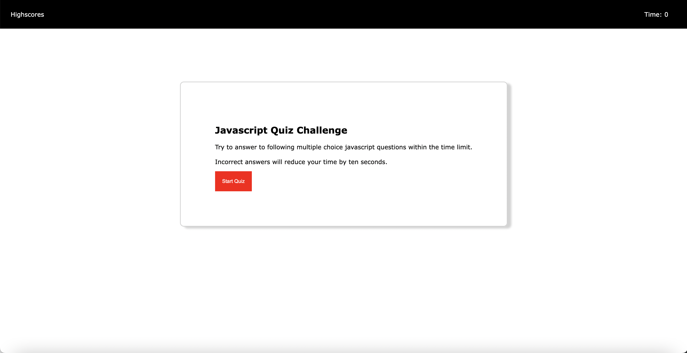
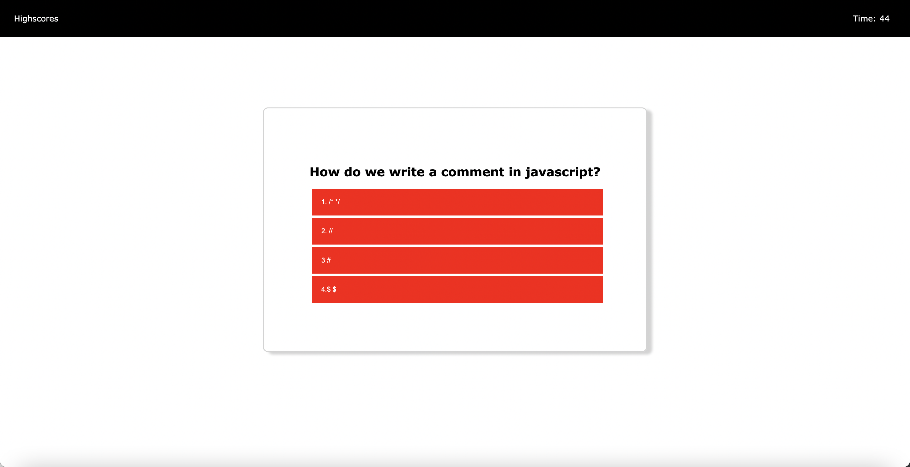
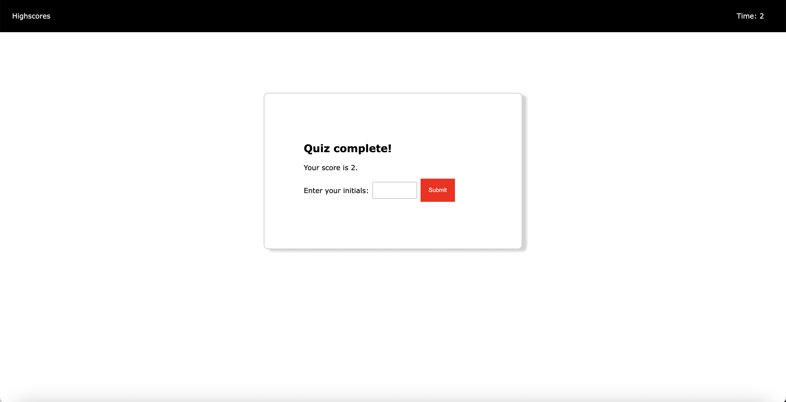
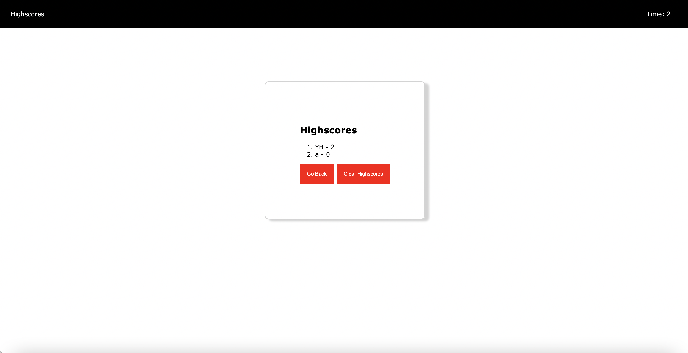

# 04 Web APIs: Code Quiz

## Description

This is a JavaScript quiz which requires extensive knowledge of HTML, CSS, and JavaScript. To ensure that the quiz was challenging yet enjoyable, I designed it to award points for correct answers while penalizing participants for incorrect responses with both time and points deductions.

## Mock-Up

The following images demonstrates the application functionality:

## Deployed site
https://neverending1.github.io/Javascript-Quiz/